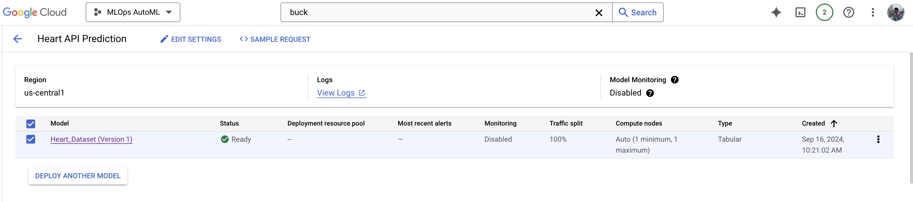

# MLops_Assignment2_Group35

## Group Number - 35

* Manglam Kumar (2022ac05260)
* Saurabh Kumar (2022ac05293)
* Rajiv Kumar (2022ac05147)
* Neeraj Kumar (2022ac05468)
* Krishna Kumar v (2022ac05373)

## Description

This project aims to build a complete end-to-end machine learning (ML) workflow using AutoML. 

This project performs hyperparameter tuning and evaluation for multiple machine learning models using RandomizedSearchCV. It iterates over a dictionary of models and their respective hyperparameters, fits each model to the training data, predicts on the test data, calculates the accuracy, and stores the best model and its accuracy in a results dictionary. Finally, it prints the best hyperparameters, accuracy, and a classification report for each model.

This project also  uses LIME library to explain the prediction of a machine learning model for a specific instance from the test dataset and and displays the explanation in the notebook with the top 10 features.

Once the best model is selected and saved to local disk, it upload the model file to a Google Cloud Storage bucket (cloud-ai-platform-9672eb94-cc15-4d36-9868-d4f0fd8a818a). Once the model is uploaded to Google Cloud Storage bucket then it imports a machine learning model from a Google Cloud Storage bucket into Google Vertex AI, and then deploys it to a Vertex AI endpoint.

Once the model is up and running it sends a prediction request to a deployed machine learning model endpoint (https://us-central1-aiplatform.googleapis.com/v1/projects/1098200441517/locations/us-central1/endpoints/3215782339686694912:predict) on Google Vertex AI.

### Detailed Summary
Refer steps mentioned in [Here](https://github.com/manglamsingh10/MLOps_Assignment_2/blob/main/Summary%20Document.pdf)

### Dependencies

1. **pandas**: A powerful data manipulation and analysis library for Python.
2. **scikit-learn**: A machine learning library for Python that provides simple and efficient tools for data mining and data analysis.
3. **lime**: A library for model interpretability, providing explanations for predictions made by machine learning models.
4. **joblib**: A library for efficient serialization of Python objects, especially for machine learning models.
5. **google-cloud-storage**: A client library for interacting with Google Cloud Storage, used for storing and retrieving data.
6. **google-cloud-aiplatform**: A client library for interacting with Google Cloud AI Platform, used for deploying and managing machine learning models.
7. **requests**: A simple and elegant HTTP library for Python, used for making HTTP requests

This project serves as a practical example of implementing AutoML with Google cloud platform (Vertex AI) & RandomizedSearchCV.

## Help
Reachout to authors via email.

## Version History

See [commit change](https://github.com/manglamsingh10/MLOps_Assignment_2/commits/main/)

## Authors

#### Contributors names and contact info

* Manglam Kumar (2022ac05260)
* Saurabh Kumar (2022ac05293)
* Rajiv Kumar (2022ac05147)
* Neeraj Kumar (2022ac05468)
* Krishna Kumar v (2022ac05373)
